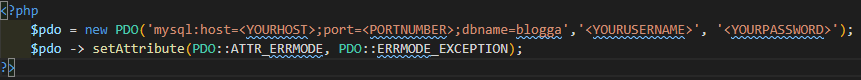
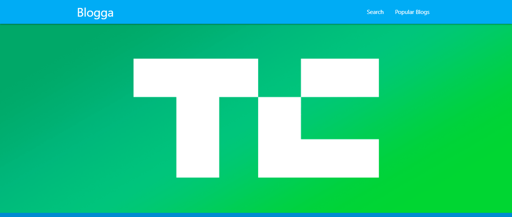

<h1>Blogga</h1>

**This was one of the first projects I made it using PHP and MySQl. It has a list of 3 of my favorite tech blogs and 5 of my favorite articles from them. The user can search for the blogs using a predictive search box and view my favorite articles as well as add, edit or delete some of there own.  To use the app run clone this repo using `git clone https://github.com/HarryH-Tech/Blogga`. Then import the `favorites.sql` table into a MySQL database called `blogga` in phpMyAdmin.  You'll then have to create a `pdo.php` file in the favorites directory and fil it in the same as below except replacing the host, port number, username and password to suit your MySQL configuration.**

**You can then navigate to `http://localhost/Blogga/index.php` to view the website.**

